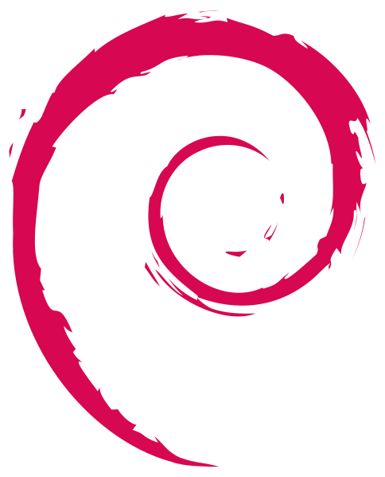
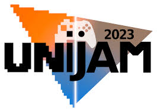
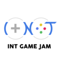
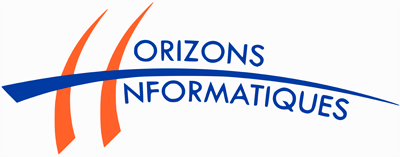
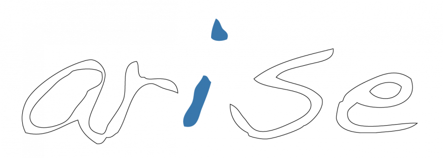

## Hi there !    I'm Simon

Good to see you, I'm a computer engineering student at the [ENSIIE](https://ensiie.fr). I'm passionated by system administration, HPC and entrepreneurship.

### Languages

|||||||||
|--|--|--|--|--|--|--|--|--|--|

### Technologies

- linux

| |  
|--|--|--|

- Scilab  
 

### Full stack project

[My website/portfolio](https://belier.iiens.net) 

### Game Jams

- Unijam 2024  ([itchio](https://mathieu-coutant.itch.io/alter-maze))  

- Global game jam 2024 ([itchio](https://globalgamejam.org/games/2024/clown-fight-4))   

- INT Game Jam 2024  ([itchio](https://hermier-jules.itch.io/ivan-the-intruder))   

### Associations

- Treasurer of Forum Horizon Informatique, an event which regroup over 20 computer science companies (Nvidia, Ubisoft, CEA ...)

<!-- 

 -->

- Secratary general of ARISE, Student system adinistration association at ENSIIE 

<!-- 

 -->
